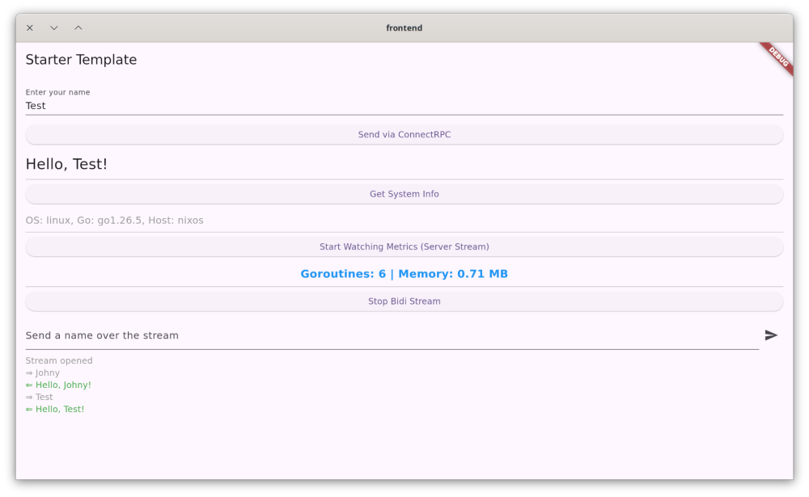

# Golang + Flutter + Protobuf Starter Template




A starter template for cross-platform applications.
It features a Flutter frontend and a Go backend running seamlessly in a single process via FFI, communicating over a Unix Domain Socket (UDS) with [ConnectRPC](https://connectrpc.com/) (protobuf).

## ✔️ Features
- **Single-Process Architecture**: Go backend is compiled as a C-shared library and loaded directly into Flutter via FFI.
- **Cross-platform**: Ready-to-use template targeting macOS, Windows, Linux, and Android, including GitHub Actions support.
- **Cross-architecture** (!!!): Isn't ARM the default in 2026? I think it is, so both amd64 and arm64 are built for macOS, Windows and Linux. 
- **ConnectRPC**: Typesafe API communication using HTTP/2 (h2c) over UDS (Linux/macOS) and TCP fallback (always TCP on Windows).
- **Streaming RPCs**: Ready-to-use examples of server-side streaming (live runtime metrics) and **full-duplex bidirectional streaming** (echo chat). The Dart client uses `package:connectrpc/http2.dart`, since bidirectional streaming requires HTTP/2 end-to-end.
- **Nix Flake**: Reproducible development environment.

## ❌ What is not implemented (yet)

- **Security**: there is no TCP/encryption/token validation. I believe this is quite specific part for every project, so it's up to you.
- **iOS support**: Not yet implemented due to deployment complexities. However, the code _should_ work without modifications, since iOS natively supports UDS.

## 🚀 Getting Started (Personalizing the Template)

When you clone this template for a new project, run the setup script to instantly rename the Go module, App ID, and project name:

```bash
make setup
```

The script will interactively ask for:
- Go module name (e.g., `github.com/myuser/myapp/backend`)
- Flutter App ID (e.g., `com.mycompany.myapp`)
- Flutter App Name (e.g., `My Awesome App`)
- Dart Package Name (default: `frontend`)

It automatically replaces all configurations, moves Android activities to the correct package path, regenerates protobufs, and updates dependencies.

## 🛠 Commands

- `make run-linux` - Build shared library and run Flutter on Linux
- `make run-macos` - Build shared library and run Flutter on macOS
- `make run-windows` - Build shared library and run Flutter on Windows (requires Git Bash + GNU make + MinGW gcc, e.g. `choco install make mingw` — cgo cannot use MSVC)
- `make build-linux-app` / `make build-macos-app` / `make build-windows-app` - Build production release bundle
- `make run-backend-standalone` - Run the Go backend natively on TCP (127.0.0.1:8080) for API testing
- `make generate` - Regenerate protobuf definitions
- `make deps` - Fetch Go/Flutter dependencies (`make deps-android` additionally patches the Flutter Gradle plugin, required before Android builds on NixOS)
- `make test`, `make lint`, `make format` - Code quality tools

## Nix Development Shells

- `nix develop` - Full environment: Go, Flutter, Buf, JDK 17, Android SDK/NDK
- `nix develop .#desktop` - Slim environment without the Android toolchain; used by CI for Linux desktop builds and quality checks (macOS CI jobs use the official Flutter/Go toolchains instead — the read-only `/nix/store` breaks Flutter's in-place `lipo` thinning of `FlutterMacOS.framework`)

On Intel Macs pass extra flags (the flake already uses the Intel-supporting `nixpkgs-26.05-darwin` branch for `x86_64-darwin`, but `nix develop` itself resolves its inner bash through the `nixpkgs` input, which dropped Intel support):

```bash
nix develop --no-write-lock-file --override-input nixpkgs github:NixOS/nixpkgs/nixpkgs-26.05-darwin
```

## CI Signing Secrets

CI builds unsigned artifacts by default. Add repository secrets to enable signing:

**Android** (skipped when `ANDROID_KEYSTORE_BASE64` is empty):
- `ANDROID_KEYSTORE_BASE64` — keystore file, base64-encoded
- `ANDROID_KEY_ALIAS`, `ANDROID_KEY_PASSWORD`, `ANDROID_STORE_PASSWORD`

**macOS** (requires an Apple Developer Program membership; skipped when `MACOS_CERT_P12_BASE64` is empty):
- `MACOS_CERT_P12_BASE64` — "Developer ID Application" certificate + private key exported as `.p12`, base64-encoded
- `MACOS_CERT_PASSWORD` — password of the `.p12`
- `APPLE_ID`, `APPLE_APP_PASSWORD`, `APPLE_TEAM_ID` — Apple ID, an [app-specific password](https://support.apple.com/102654), and Team ID for notarization (notarization is skipped when `APPLE_ID` is empty)

Signed + notarized macOS builds pass Gatekeeper on download. Unsigned (ad-hoc) builds require `xattr -cr MyApp.app` after unzipping.

**Windows** (requires an [Azure Artifact Signing](https://learn.microsoft.com/en-us/azure/artifact-signing/overview) account, formerly Trusted Signing — the Basic tier is enough; skipped when `AZURE_SIGNING_ENDPOINT` is empty):
- `AZURE_SIGNING_ENDPOINT` — e.g. `https://weu.codesigning.azure.net`
- `AZURE_SIGNING_ACCOUNT`, `AZURE_SIGNING_PROFILE` — signing account and certificate profile names
- `AZURE_TENANT_ID`, `AZURE_CLIENT_ID`, `AZURE_CLIENT_SECRET` — Entra app registration with the "Artifact Signing Certificate Profile Signer" role

Signed Windows builds are uploaded as separate `windows-app-<arch>-signed` artifacts. To switch to OIDC instead of a client secret, add an `azure/login` step (with `permissions: id-token: write`) to the `sign-windows` job and drop the three `azure-*` inputs. Note: the `windows-11-arm` runner is free for public repositories; in private repositories it consumes standard Actions minutes (2x Windows multiplier).

## TCP vs UDS

By default, the template uses UDS (Unix Domain Sockets) in production and development for maximum performance.
On Windows, where `dart:io` does not support UDS, the app always uses TCP on `127.0.0.1` with a random (ephemeral) port, so multiple instances never collide.

You can force TCP transport during development:
```bash
flutter run --dart-define=APP_USE_TCP=true
```

Without an explicit address the embedded backend picks an ephemeral port. Set `APP_TCP_ADDRESS` to connect to an externally running backend instead (e.g. `make run-backend-standalone` listens on `127.0.0.1:8080`):
```bash
flutter run --dart-define=APP_USE_TCP=true --dart-define=APP_TCP_ADDRESS=127.0.0.1:8080
```

## License

This template is released under the [MIT License](https://opensource.org/licenses/MIT).